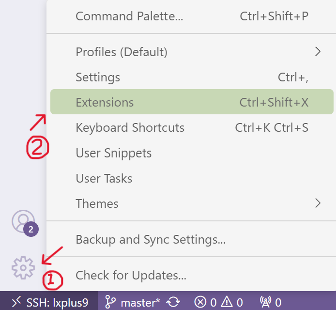
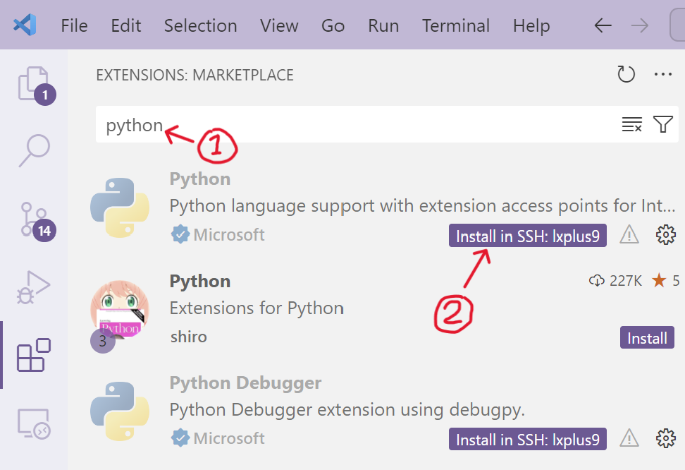
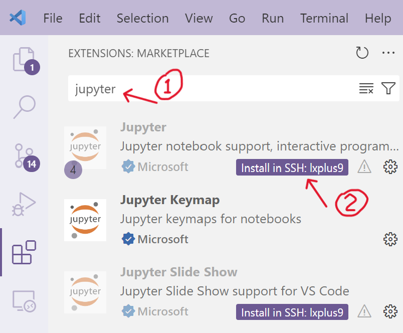
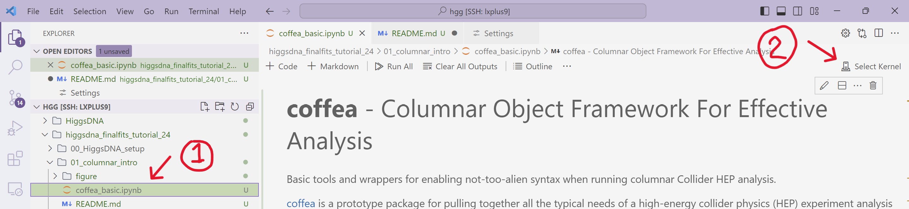
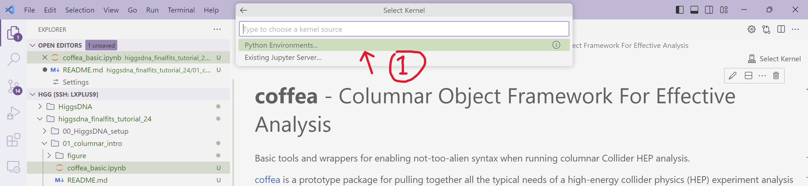
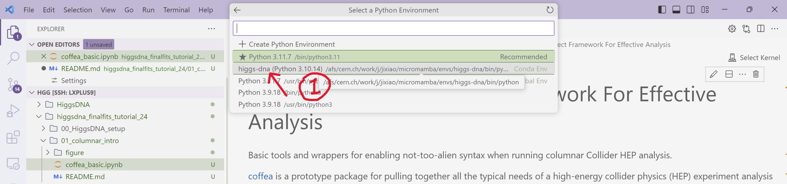
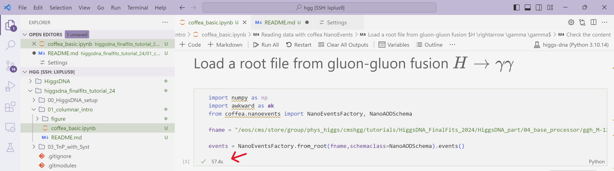
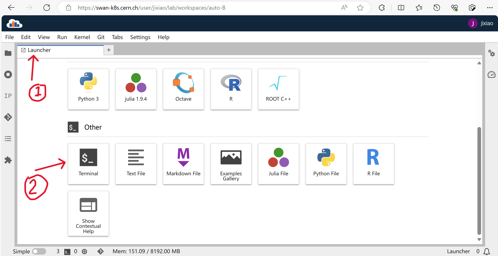
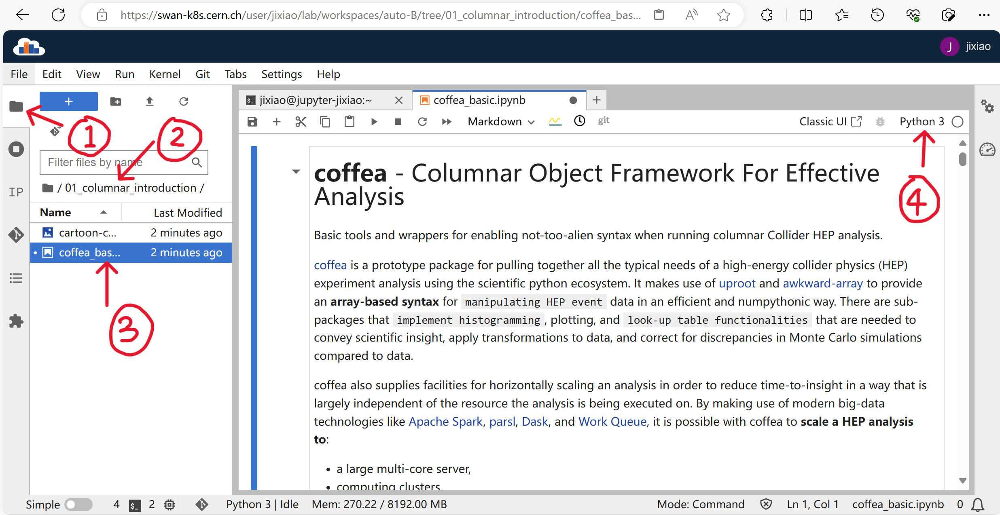

# Setting up the environment

In this section, we will briefly look at columnar operation via [coffea](https://coffeateam.github.io/coffea/index.html) package.

We recommend the use of a **notebook** for interactivity. This makes it easier to visualize the results obtained at each step.

The following are three ways to set up the environment needed for the hands-on (clickable item list):


<details>
  <summary> <b>Using VSCode to run a python notebook</b></summary>

1. Go to `Extensions` in VSCode 

    

2. Search for "python" in the search box. And hit `install in SSH: lxplus9` to install the **Python** extension from **Microsoft**

    


3. Once **Python** extension installed. Continue to install the **Jupyter** extension.
    
    Again, search for "jupyter". And install **Jupyter** extension from **Microsoft**

    

4. We are able to run the notebook in VSCode. Let us have a quick test.

    - Find the `higgsdna_finalfits_tutorial_24/01_columnar_introduction/coffea_basic.ipynb` in the `File Explore` and open it.

        In the top right corner, hit `Select Kernel` to choose the python kernel. 

        

    - Click `Python Environments...` in the pop-up window.

        

    - Choose the **higgs-dna** environment that has been installed by following [00_HiggsDNA_setup](https://gitlab.cern.ch/jspah/higgsdna_finalfits_tutorial_24/-/tree/master/00_HiggsDNA_setup?ref_type=heads).  

        

    - Each code cell could be executed with **`Shift+Enter`**. Go to the first python code cell (Under **Load a root file from gluon-gluon fusion $H \rightarrow \gamma \gamma$**), then **`Shift+Enter`**, if it works, you will be able to see a checkmark in the bottom right corner (**Note**: If this is the first execution, it may take longer).

        


</details>

<details>
  <summary> <b>Using SWAN to run a python notebook</b></summary>

If you enconter some problems in setting the environment in VSCode. You can use [**SWAN**](https://swan.docs.cern.ch/intro/what_is/#what-is-swan) (Service for Web-based ANalysis) provided by CERN.

By connecting to **SWAN**, users have immediate access to the CERN storage, software and computing resources they need to do their analyses.  

The **SWAN** interface is built on top of Jupyter, allowing users to write and run notebooks by only using their web browser. **SWAN** users can create notebooks in four different languages: Python (2 and 3), C++, R and Octave.

All the needed packages for the **first Hands-on** are already installed in some of the **SWAN** settings. To introduce the basic of columnar operation. We can go without `higgs-dna` environment.

Let us try **SWAN**.

1. Go to the **SWAN** service: https://swan.cern.ch with your web browser and log into your CERN account. Then, start a new terminal session in the **Launcher** tab. 

    

2. Copy the notebook to your local folder, i.e., run 

    ```
    cp -r /eos/cms/store/group/phys_higgs/cmshgg/tutorials/HiggsDNA_FinalFits_2024/HiggsDNA_part/01_intro/01_columnar_introduction .
    ```

3. Open the "File Explore" panel, go to the folder `01_columnar_introduction`. Then double click the `coffea_basic.ipynb` notebook. You can already start playing with the notebook (make sure that you are using the `Python 3` kernel, check the top right corner).

    


</details>


<details>
  <summary> <b>Running the script with higgs-dna environment</b></summary>

The most straightforward way to play with the `coffea` package is to execute the python code with command lines.

A python script `coffea_basic.py` is provieded. We can run the code with the `higgs-dna` evironment.

```
micromamba activate higgs-dna
python coffea_basic.py
```

Please note:

- `coffea_basic.py` just simply gathers the code from the notebook cells. You can find comments (e.g., `# cell 21`) that indicate which notebook cell the code snippet matches. 
    
    **Most of the code snippets are commented. You can uncomment them step by step**.
- The output from `python coffea_basic.py` is not as pretty  as the notebook output. Particularly, we can not view histograms within the terminal directly. 

    **Thus, the histograms are stored as `png` files.**

    Some tips to view the plots:
    
    - Using `ssh -XY` to enable `X11` forwarding for GUI, if you have a stable connection to lxplus. Then you can use `eog` to open png files.

    - To browser plots and files interactively, we could follow the suggestion from common analysis tool (**CAT**) group: [Interactive Plot Browser](https://cms-analysis.docs.cern.ch/guidelines/other/plot_browser/#manage-access-control).
    
        In this way, we could put plots to the **EOS**. Then the plots could be viewed from your own website with the [plot browser](https://cms-analysis.docs.cern.ch/guidelines/other/plot_browser/#install-the-plot-browser).

    - Simply download the plots locally.

</details>
