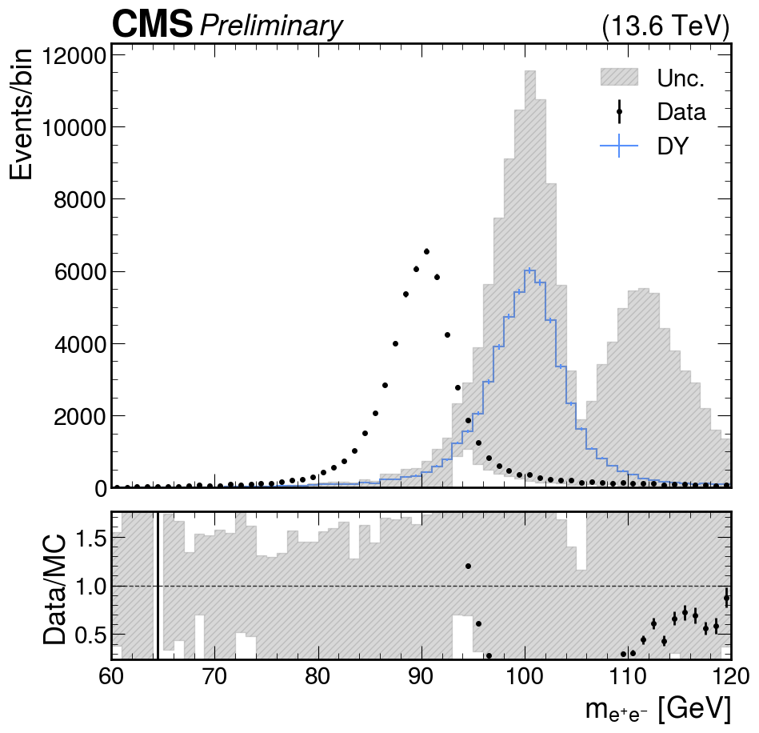

# Part 3: Corrections and systematics

## Introduction

In this tutorial, we will try to add corrections and the systematic uncertainties.

## Add the photon energy smearing correction and systematic

Let's go to the exercise 3 folder:

```bash
cd <your_tutorial_folder>/higgsdna_finalfits_tutorial_24/03_corrections_systematics
export PART03=`pwd`
``` 

Check all available corrections and systematics in the HiggsDNA framework, i.e.,

- [object_corrections](https://gitlab.cern.ch/HiggsDNA-project/HiggsDNA/-/blob/a2cddf20737e002ada4d36bfef2d7bf1d2dcbf69/higgs_dna/systematics/__init__.py#L119): correction applied on the physics object, e.g., electron, muon, photon, jet, etc.

- [object_systematics](https://gitlab.cern.ch/HiggsDNA-project/HiggsDNA/-/blob/a2cddf20737e002ada4d36bfef2d7bf1d2dcbf69/higgs_dna/systematics/__init__.py#L34): systematic uncertainty related to the physics object correction.

- [weight_corrections](https://gitlab.cern.ch/HiggsDNA-project/HiggsDNA/-/blob/a2cddf20737e002ada4d36bfef2d7bf1d2dcbf69/higgs_dna/systematics/__init__.py#L158): weight on the event to improve the Data and MC agreement. Sometimes, weight is added to each object, e.g., Photon, then a product of all the object weight will be used to weight the event.

- [weight_systematics](https://gitlab.cern.ch/HiggsDNA-project/HiggsDNA/-/blob/a2cddf20737e002ada4d36bfef2d7bf1d2dcbf69/higgs_dna/systematics/__init__.py#L141): systematic uncertainty related to the weight.

The photon energy smearing correction and systematic name is `Smearing`. We need to add this name `Smearing` to the `corrections` and `systematics` blocks in the `runner.json`. You can compare the `configs/runner.json` between `03_corrections_systematics` and `02_TnP_example`.

Now, let us follow the last section `02_TnP_example` to re-run the code, i.e.,

```bash
# not necessary if you have run already
voms-proxy-init --rfc --voms cms -valid 192:00
micromamba activate higgs-dna
pushd ../HiggsDNA/scripts/
python pull_files.py --all
popd

# run the new commands
cd configs
source run_HiggsDNA.sh
```

Then go back to the exercise 3 folder, check the what's in the output folder `03_NTuples`.

```bash
cd $PART03
tree 03_NTuples/ 
```

You should see there two more folders of DY: `Smearing_up` and `Smearing_down`.

<details>
  <summary> <b>Files in the folder</b></summary>

```
03_NTuples/
├── DataC_2022
│   └── nominal
│       ├── 03270072-9dc1-11ee-94e0-52c59a83beef_%2FEvents%3B1_0-731205.parquet
│       ├── 2a35cf50-9dbb-11ee-a239-2ed09a83beef_%2FEvents%3B1_0-579934.parquet
│       ├── 2a35cf50-9dbb-11ee-a239-2ed09a83beef_%2FEvents%3B1_1159868-1739802.parquet
│       ├── 2a35cf50-9dbb-11ee-a239-2ed09a83beef_%2FEvents%3B1_579934-1159868.parquet
│       ├── 3017372e-9dbb-11ee-97a9-37d09a83beef_%2FEvents%3B1_0-502544.parquet
│       └── 3017372e-9dbb-11ee-97a9-37d09a83beef_%2FEvents%3B1_502544-1005087.parquet
└── DY
    ├── nominal
    │   ├── 1de65ae6-c1f4-11ee-bfa9-9784e4a9beef_%2FEvents%3B1_0-145976.parquet
    │   ├── 392128ea-c1d6-11ee-9ef4-0f3d8e80beef_%2FEvents%3B1_0-151425.parquet
    │   ├── 3a249176-c1dd-11ee-829f-ca090d0abeef_%2FEvents%3B1_0-143657.parquet
    │   ├── 5afbecc4-c191-11ee-86c5-20339e86beef_%2FEvents%3B1_0-143339.parquet
    │   └── d37c0bf0-c193-11ee-84f4-061ca8c0beef_%2FEvents%3B1_0-149290.parquet
    ├── Smearing_down
    │   ├── 1de65ae6-c1f4-11ee-bfa9-9784e4a9beef_%2FEvents%3B1_0-145976.parquet
    │   ├── 392128ea-c1d6-11ee-9ef4-0f3d8e80beef_%2FEvents%3B1_0-151425.parquet
    │   ├── 3a249176-c1dd-11ee-829f-ca090d0abeef_%2FEvents%3B1_0-143657.parquet
    │   ├── 5afbecc4-c191-11ee-86c5-20339e86beef_%2FEvents%3B1_0-143339.parquet
    │   └── d37c0bf0-c193-11ee-84f4-061ca8c0beef_%2FEvents%3B1_0-149290.parquet
    └── Smearing_up
        ├── 1de65ae6-c1f4-11ee-bfa9-9784e4a9beef_%2FEvents%3B1_0-145976.parquet
        ├── 392128ea-c1d6-11ee-9ef4-0f3d8e80beef_%2FEvents%3B1_0-151425.parquet
        ├── 3a249176-c1dd-11ee-829f-ca090d0abeef_%2FEvents%3B1_0-143657.parquet
        ├── 5afbecc4-c191-11ee-86c5-20339e86beef_%2FEvents%3B1_0-143339.parquet
        └── d37c0bf0-c193-11ee-84f4-061ca8c0beef_%2FEvents%3B1_0-149290.parquet

6 directories, 21 files
```
</details>

Now, we can use the output files to make some histograms. Here are also processed parquet files. You can use soft-links to link the output files to your current folder if you haven't had those output files yet.

```bash
cd $PART03
ln -s /eos/cms/store/group/phys_higgs/cmshgg/tutorials/HiggsDNA_FinalFits_2024/HiggsDNA_part/02_03_TnP/03_NTuples 03_NTuples
```

## Hands-on

Now that we have the output, we can produce some data/mc comparison plots. Two options are available, a notebook (`plotter.ipynb`), and a python script (`plotter.py`).

The two are equivalent, try them out and get experienced with the manipulation of the awkward arrays to make plots.

If you are using **SWAN** and haven't clone the [higgsdna_finalfits_tutorial_24](https://gitlab.cern.ch/jspah/higgsdna_finalfits_tutorial_24) repo. You can also copy the exercise 3 folder from eos with the following command:

```bash
cp -r /eos/cms/store/group/phys_higgs/cmshgg/tutorials/HiggsDNA_FinalFits_2024/HiggsDNA_part/02_03_TnP/03_corrections_systematics 03_corrections_systematics

```

<details>
  <summary> <b>Running the script with higgs-dna environment</b></summary>

We can run `plotter.py` with the `higgs-dna` evironment.

```
micromamba activate higgs-dna
python plotter.py
```

Please note:

- `plotter.py` just simply gathers the code from the notebook cells. You can find comments (e.g., `# cell 7`) that indicate which notebook cell the code snippet matches. 
    
    **Most of the code snippets are commented. You can uncomment them step by step**.
- The output from `python plotter.py` is not as pretty  as the notebook output. Particularly, we can not view histograms within the terminal directly. 

    **Thus, the histograms are stored as `png` files.**

    Some tips to view the plots:
    
    - Using `ssh -XY` to enable `X11` forwarding for GUI, if you have a stable connection to lxplus. Then you can use `eog` to open png files.

    - To browser plots and files interactively, we could follow the suggestion from common analysis tool (**CAT**) group: [Interactive Plot Browser](https://cms-analysis.docs.cern.ch/guidelines/other/plot_browser/#manage-access-control).
    
        In this way, we could put plots to the **EOS**. Then the plots could be viewed from your own website with the [plot browser](https://cms-analysis.docs.cern.ch/guidelines/other/plot_browser/#install-the-plot-browser).

    - Simply download the plots locally.

</details>

**Tasks:**
- Produce Data/MC comparison plot for $Z\rightarrow e^+e^-$ events (mass, probe $p_T$, probe $r_{9}$).

## Further task

Add the other corrections and systematics **one by one**. E.g.,

- Photon energy scale, the name is `Scale`. Note: the correction should be applied to Data, the uncertainty should be added to MC.
  

Just follow the steps we've done, i.e.,

- Update the `configs/runner.json`.
- Re-run the processing command in `run_HiggsDNA.sh`.
- Merge the files for all the systematics.
- Figure out how to sum all the uncertainties.

## Advanced exercise

In this section, let us try to create an object correction and its uncertainty in `HiggsDNA`.

Let us call this correction `Tutorial_corr`. The object correction is a function of the **photon pt**. The binning of the photon pt is [0, 60, 90, 120, 180] GeV. For photons with pt in those bins:

- The nominal is shifted with [5, 5, 10, 10] GeV,
- The up variation shifts the photon pT with [5, 10, 15, 20] GeV
- The down variation shifts the photon pT with [-5, -10, -15, -20] GeV

To add this systematic in the HiggsDNA, folowing these steps:

- To create the correction json file, you can check the `correctionlib` [tutorial](https://cms-nanoaod.github.io/correctionlib/correctionlib_tutorial.html#Systematics). Here just run the prepare script to get the json file.

  ```bash
  # activate higgs-dna, unnecessary if you already did
  micromamba activate higgs-dna

  cd $PART03
  python scripts/mkJSON.py
  ```

  You should see an output file `tutorial_correction.json.gz`.

- Then put the json file the following folder
  
  ```bash
  mv tutorial_correction.json.gz $PART03/../HiggsDNA/higgs_dna/systematics
  ```

- Also use the folllowing scripts to replace those in `HiggsDNA`:

  ```bash
  cp scripts/Tutorial_Weight_Syst.py $PART03/../HiggsDNA/higgs_dna/systematics
  cp scripts/__init__.py $PART03/../HiggsDNA/higgs_dna/systematics 
  ```

- Then, add the `Tutorial_corr` systematic to the `configs/runner.json`

- Run the processing step and check the output files. Do you see the folders related to the `Tutorial_corr`?

- Finally, if you make the plot for this `Tutorial_corr`, you could see the following figure. It's not a good correction 😂, but shows you how to implement correction within HiggsDNA.

<details>
<summary> <b>Figure of Tutorial_corr (click to expand)</b></summary>

  

</details>