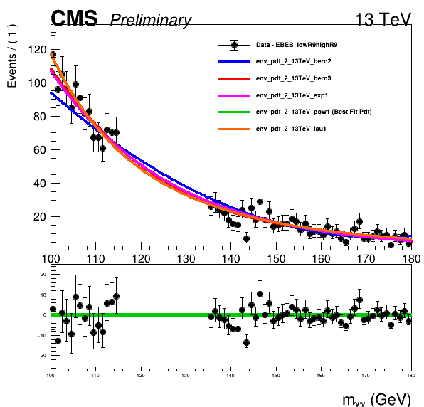
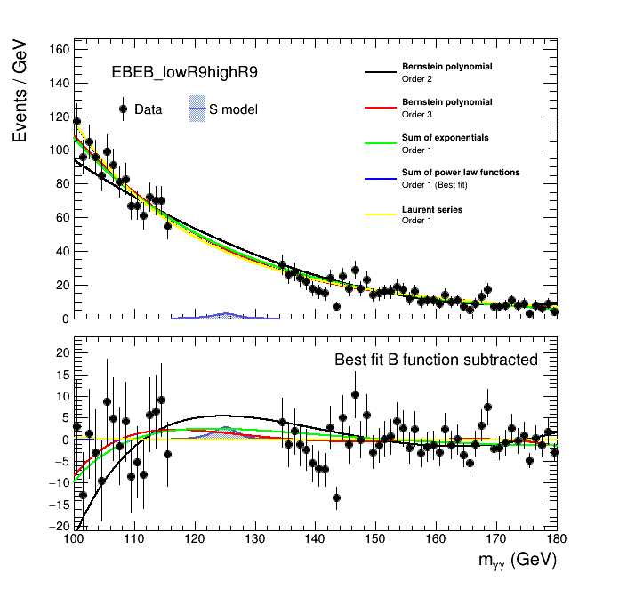

# Background modeling
In this section we will learn how to build the background models from data using the discrete-profiling method. First let's go to the Background directory:
```
cd $CMSSW_BASE/src/flashggFinalFit/Background
```

Unlike the other sections, the background modeling code is written in C++. Therefore we need to compile before running the scripts (ignore the many compilation warnings).
```
cmsenv
make clean
make
```
In the near future we will replace the background modeling code with a pythonized version. This will be easier to understand, and adapt to specific analysis needs. We will update the [ReadMe](https://github.com/cms-analysis/flashggFinalFit/tree/higgsdnafinalfit/Background) when the changes have been made. For now, if you make edits to the C++ script, then make sure to compile the code again.

## F-test
The background modeling in CMS H $\rightarrow\gamma\gamma$ analyses uses the discrete-profiling method. Here, we consider an envelope of functions from different families (Bernstein polynomials, Exponentials, Laurent series, Power law) to fit the smoothly-falling background mass distribution. 

The envelope of functions is constructed directly from data. The functions are stored in a `RooMultiPdf` object. The background F-test code is used to decide which functions should enter the envelope by applying weak goodness-of-fit criteria. Then in the final results extraction, the choice of background PDF is treated as an additional discrete nuisance parameter in the fit. In addition the normalisation and shape parameters of the background model are unconstrained (i.e. freely floating).

In a similar way to the signal modeling, we steer the background modeling code with a `config.py` script e.g. `config_tutorial.py`:
```
backgroundScriptCfg = {

  # Setup
  'inputWS':'PATH_TO_INPUTS/workspaces/data/allData_2022preEE.root', # location of 'allData.root' file
  'cats':'auto', # auto: automatically inferred from input ws
  'catOffset':0, # add offset to category numbers (useful for categories from different allData.root files)  
  'ext':'tutorial', # extension to add to output directory
  'year':'combined', # Use combined when merging all years in category (for plots)

  # Job submission options
  'batch':'condor', # [condor,SGE,IC,local]
  'queue':'espresso' # for condor e.g. microcentury

}
```
The F-test code is parallelized such that it generates a single job per analysis category. You can run the code with:
```
python3 RunBackgroundScripts.py --inputConfig config_tutorial.py --mode fTestParallel
```

The output model files are stored in `outdir_tutorial`. Let's open one up and check the contents:
```
$ python3
>>> import ROOT
>>> f = ROOT.TFile("outdir_tutorial/CMS-HGG_multipdf_EBEB_lowR9highR9.root")
>>> w = f.Get("multipdf")
>>> w.Print()
```
<details>
<summary>Output</summary>

```
RooWorkspace(multipdf)  contents

variables
---------
(CMS_hgg_EBEB_lowR9highR9_13TeV_bkgshape_norm,CMS_hgg_mass,IntLumi,SqrtS,env_pdf_2_13TeV_bern2_p0,env_pdf_2_13TeV_bern2_p1,env_pdf_2_13TeV_bern3_p0,env_pdf_2_13TeV_bern3_p1,env_pdf_2_13TeV_bern3_p2,env_pdf_2_13TeV_exp1_p1,env_pdf_2_13TeV_lau1_l1,env_pdf_2_13TeV_pow1_p1,pdfindex_EBEB_lowR9highR9_13TeV)

p.d.f.s
-------
RooMultiPdf::CMS_hgg_EBEB_lowR9highR9_13TeV_bkgshape[ _pdfs=(env_pdf_2_13TeV_bern2,env_pdf_2_13TeV_bern3,env_pdf_2_13TeV_exp1,env_pdf_2_13TeV_pow1,env_pdf_2_13TeV_lau1) _corrs=(constenv_pdf_2_13TeV_bern2,constenv_pdf_2_13TeV_bern3,constenv_pdf_2_13TeV_exp1,constenv_pdf_2_13TeV_pow1,constenv_pdf_2_13TeV_lau1) _index=pdfindex_EBEB_lowR9highR9_13TeV ] = 4.33759e-11/1
RooBernsteinFast<2>::env_pdf_2_13TeV_bern2[ x=CMS_hgg_mass coefList=(env_pdf_2_13TeV_bern2_p0_sq,env_pdf_2_13TeV_bern2_p1_sq) ] = 0.254062
RooBernsteinFast<3>::env_pdf_2_13TeV_bern3[ x=CMS_hgg_mass coefList=(env_pdf_2_13TeV_bern3_p0_sq,env_pdf_2_13TeV_bern3_p1_sq,env_pdf_2_13TeV_bern3_p2_sq) ] = 0.198069
RooAddPdf::env_pdf_2_13TeV_exp1[ env_pdf_2_13TeV_exp1_recursive_fraction_env_pdf_2_13TeV_exp1_e1 * env_pdf_2_13TeV_exp1_e1 ] = 0.00517881/1
RooExponential::env_pdf_2_13TeV_exp1_e1[ x=CMS_hgg_mass c=env_pdf_2_13TeV_exp1_p1 ] = 0.00517881
RooAddPdf::env_pdf_2_13TeV_lau1[ env_pdf_2_13TeV_lau1_l1 * env_pdf_2_13TeV_lau1_pow0 + env_pdf_2_13TeV_lau1_recursive_fraction_env_pdf_2_13TeV_lau1_powl1 * env_pdf_2_13TeV_lau1_powl1 ] = 4.32581e-10/1
RooPower::env_pdf_2_13TeV_lau1_pow0[ x=CMS_hgg_mass c=-4 ] = 2.4818e-09
RooPower::env_pdf_2_13TeV_lau1_powl1[ x=CMS_hgg_mass c=-5 ] = 1.75169e-11
RooAddPdf::env_pdf_2_13TeV_pow1[ env_pdf_2_13TeV_pow1_recursive_fraction_env_pdf_2_13TeV_pow1_e1 * env_pdf_2_13TeV_pow1_e1 ] = 4.33759e-11/1
RooPower::env_pdf_2_13TeV_pow1_e1[ x=CMS_hgg_mass c=env_pdf_2_13TeV_pow1_p1 ] = 4.33759e-11

functions
--------
RooFormulaVar::env_pdf_2_13TeV_bern2_p0_sq[ actualVars=(env_pdf_2_13TeV_bern2_p0) formula="x[0]*x[0]" ] = 2.29663e-08
RooFormulaVar::env_pdf_2_13TeV_bern2_p1_sq[ actualVars=(env_pdf_2_13TeV_bern2_p1) formula="x[0]*x[0]" ] = 0.0907033
RooFormulaVar::env_pdf_2_13TeV_bern3_p0_sq[ actualVars=(env_pdf_2_13TeV_bern3_p0) formula="x[0]*x[0]" ] = 0.0508584
RooFormulaVar::env_pdf_2_13TeV_bern3_p1_sq[ actualVars=(env_pdf_2_13TeV_bern3_p1) formula="x[0]*x[0]" ] = 0.161302
RooFormulaVar::env_pdf_2_13TeV_bern3_p2_sq[ actualVars=(env_pdf_2_13TeV_bern3_p2) formula="x[0]*x[0]" ] = 0.049569
RooRecursiveFraction::env_pdf_2_13TeV_exp1_recursive_fraction_env_pdf_2_13TeV_exp1_e1[ list=(1) ] = 1
RooRecursiveFraction::env_pdf_2_13TeV_lau1_recursive_fraction_env_pdf_2_13TeV_lau1_powl1[ list=(1,env_pdf_2_13TeV_lau1_l1) ] = 0.831568
RooRecursiveFraction::env_pdf_2_13TeV_pow1_recursive_fraction_env_pdf_2_13TeV_pow1_e1[ list=(1) ] = 1

datasets
--------
RooDataHist::roohist_data_mass_EBEB_lowR9highR9(CMS_hgg_mass)
```
</details>

<br>

The F-test will also produce some plots in `outdir_tutorial/bkgfTest-Data`. For example:

<details>
<summary> EBEB_lowR9highR9 envelope of functions</summary>


</details>

## Plotting script 
There is a script in the `Plots` directory which will produces a prettier plot and overlays the corresponding signal model to show the signal-vs-background in that particular category. You can run this for all categories with the following command:
```
cd ../Plots
for cat in {EBEB_highR9highR9,EBEB_highR9lowR9,EBEB_lowR9highR9,EBEE_highR9highR9,EBEE_highR9lowR9,EBEE_lowR9highR9,EEEB_highR9highR9,EEEB_highR9lowR9,EEEB_lowR9highR9,EEEE_incl}; do python3 makeMultipdfPlot.py --inputWSFile ../Background/outdir_tutorial/CMS-HGG_multipdf_${cat}.root --cat ${cat} --ext tutorial --mass 125.38 --inputSignalWSFile ../Signal/outdir_packaged/CMS-HGG_sigfit_packaged_${cat}.root; done
```
The output is stored in `plots_tutorial/` and looks like this: 
<details>
<summary> Prettier EBEB_lowR9highR9 envelope of functions</summary>


</details>