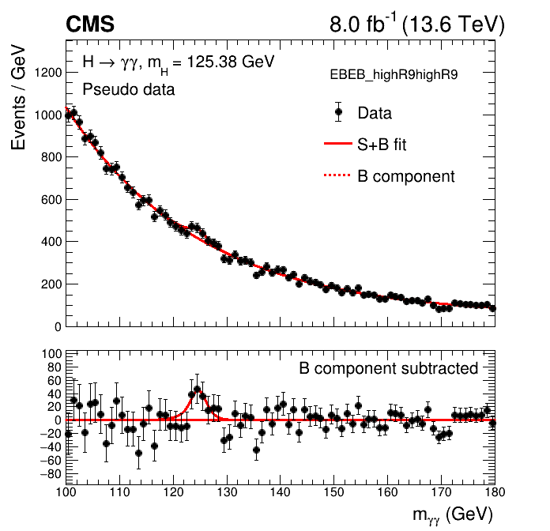
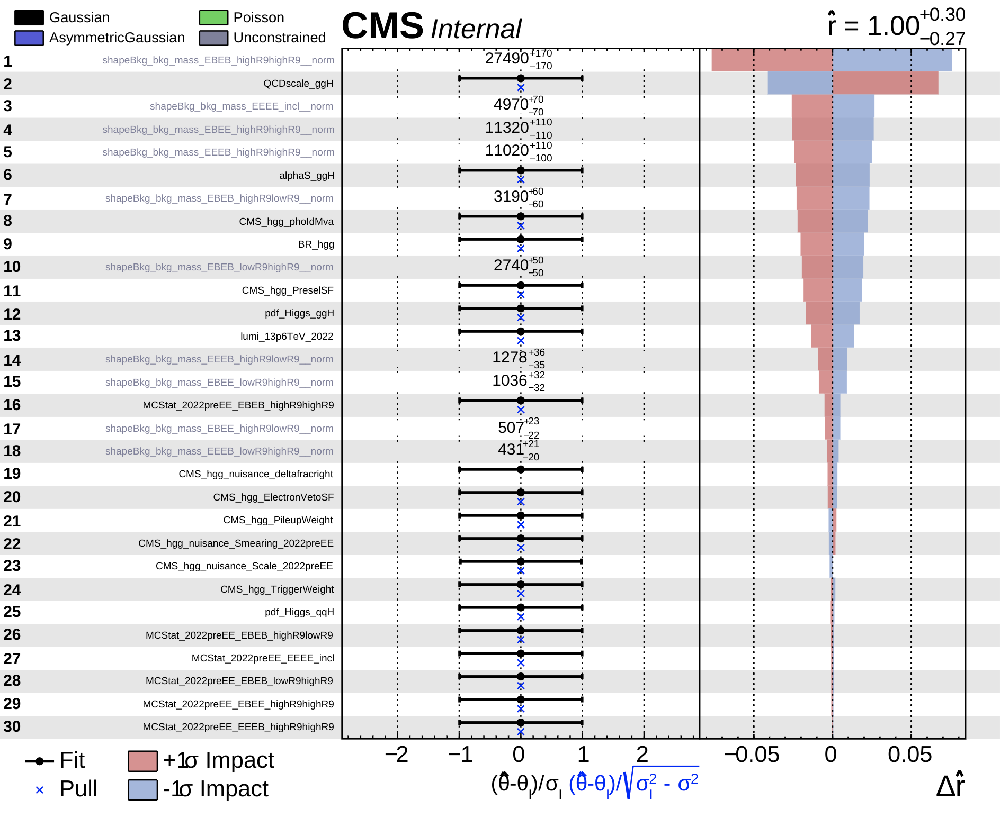

# Combine fits and plotting
In the final section we will put everything together to perform the fit. We will also look at some of the plotting scripts available in the package.

Let's move to the `Combine` directory:
```
cd $CMSSW_BASE/src/flashggFinalFit/Combine
```

The first step is to copy everything across to this directory. By following the commands below we will match the signal and background model locations to the paths specified in `Datacard_tutorial.txt`:
```
mkdir -p Models/signal
mkdir -p Models/background
cp ../Signal/outdir_packaged/CMS-HGG_sigfit_packaged*.root Models/signal/
cp ../Background/outdir_tutorial/CMS-HGG_multipdf*.root Models/background/
cp ../Datacard/Datacard_tutorial.txt .
```
If you did not have time to complete any of the previous sections, then you can find the model files and datacard in the following directory to copy to your area:
```
/eos/cms/store/group/phys_higgs/cmshgg/tutorials/HiggsDNA_FinalFits_2024/FinalFits_tutorial/combine_inputs
```

## Text2workspace
The text datacard created in the previous (Datacard) section contains (or points to) all of the inputs that Combine requires to do statistical inference. By running the `text2workspace` command, we convert the text datacard into a workspace that contains the inputs. In the conversion, we also specify a model that describes the parameters of interest (POIs) and how they are related to the rates of processes in the workspace.

In flashggFinalFit, we have a job submission script to run `text2workspace`. Run the following command:
```
python3 RunText2Workspace.py --mode mu_inclusive --batch local --ext _tutorial
```
The model is defined by the `--mode` option, which picks out a parametrization from the dictionary defined in `models.py`. In this tutorial we will use the `mu_inclusive` model, which defines a single signal strength ($r$) to scale the rate of all signal processes simultaneously. You can use the `multiSignalModel` option to map different parameters of interest (POI) to the different signal processes e.g. the `mu` model introduces a separate signal strength for each of the four major Higgs boson production modes. Wildcards can be used if necessary. 

In the tutorial example, the analysis categories are not defined to separate the different Higgs boson production modes. Therefore we do not have the sensitivity to simultaneously fit ggH and VBF. This would be different if we added analysis categories which were pure in VBF e.g. requiring a dijet system with high invariant mass and large $\Delta\eta_{jj}$.

You can also specify pre-defined `PhysicsModel`'s in [Combine](https://github.com/cms-analysis/HiggsAnalysis-CombinedLimit/tree/main/python) for the signal parametrisation e.g.
```
"kappas":"-P HiggsAnalysis.CombinedLimit.LHCHCGModels:K2 --PO BRU=0"
```
or even write your own in Combine!

For large analyses with many categories then we recommend to use a batch system to submit this job.

Let's have a look at the compiled workspace e.g.:
```
$ python3
>>> import ROOT
>>> f = ROOT.TFile("Datacard_tutorial_mu_inclusive.root")
>>> w = f.Get("w")
>>> w.Print()

# Print all the variables
>>> w.allVars().Print("v")

# Print the signal-plus-background model
>>> w.pdf("model_s").Print("v")
```

<details>
<summary>Or in the ROOT interpreter</summary>

```
$ root -b Datacard_tutorial_mu_inclusive.root
root [1] w->Print()
root [2] w->allVars().Print("v")
root [3] w->pdf("model_s")->Print("v")
```
</details>

## Running the fits
If you are confident with using Combine and know its many options, then feel free to run the commands directly on the workspace. We also have provided a wrapper script, `RunFits.py`, which can be used to run the combine jobs. This is based on the `combineTool.py` for job submission. The fits are steered by an `inputs.json` file e.g. `inputs_tutorial/inputs_tutorial_profile1D_syst.json`:
```
{
    "mu_inclusive":{
        "pois":"r",
        "fits":"profile1D:syst:r",
        "points":"20:10",
        "fit_opts":"--setParameterRanges r=0,2 --saveSpecifiedNuis all --freezeParameters MH"
    }
}
```

* `"pois"`: full comma-separated list of all parameters of interest (POIs) in the model
* `"fits"`: fit details deliminated by ":", where the first terms is the type of fit e.g. `profile1D` performs a 1D likelihood scan, profiling the other POIs (if multiple exist). The second term is a name to identify the fit. The third terms is the POI to fit. If "all" is used then fits will be ran for all POIs in the model.
* `"points"`: (total number of points):(points per job)
* `"fit_opts"`: combine options for fit e.g. `--setParameters`, `setParameterRanges`, `--freezeParameters`.

You can define multiple fits using the `+` deliminator (see `inputs_tutorial_profile1D_freezeNuisances.json`).

The different types of fit that `RunFits.py` accommodates are described below:
* `bestfit`: extract single best-fit point. You can add the option `--saveWorkspace` to the `"fit_opts"` string to save the postfit workspace. This can then be loaded with `RunFits.py` via the `--snapshotWSFile` option.
* `profile1D`: 1D likelihood scan where other POIs are profiled
* `scan1D`: 1D likelihood scan where other POIs are fixed.
* `robustHesse`: extract covariance/correlation matrix between fit parameters
* `fixed`: extract deltaNLL for fixed point in parameter space e.g. to calculate the p-value with respect to the SM expectation.
* `singles`: extract the $\pm1\sigma$ confidence intervals.
* `AsymptoticLimits`: use for extracting limits.
* `profile2D`: 2D likelihood scan where other POIs are profiled.
* `scan2D`: 2D likelihood scan where other POIs are fixed.

A more complete set of `input.json` files (for inspiration) are provided in the `example_inputs` directory.

### Asimov fits
We will start by running the fits for an Asimov toy. This is what we call the "expected" fits, where the toy data is generated with each parameter set to it's SM value, and statistical fluctuations from the model prediction are ignored. We will throw the toy with `r=1` (SM) and extract the single best-fit point. Let's run the command with the `--dryRun` option to check we understand the combine job that has been produced:
```
python3 RunFits.py --inputJson inputs_tutorial/inputs_tutorial_bestfit_syst.json --mode mu_inclusive --ext _tutorial --mass 125.38 --batch condor --queue espresso --dryRun
```
 There are a number of common options in `RunFits.py` which we add to every combine job to help speed up the fits:
```
  parser.add_option('--commonOpts', dest='commonOpts', default="--cminDefaultMinimizerStrategy 0 --X-rtd MINIMIZER_freezeDisassociatedParams --X-rtd MINIMIZER_multiMin_hideConstants --X-rtd MINIMIZER_multiMin_maskConstraints --X-rtd MINIMIZER_multiMin_maskChannels=2", help="Common combine options for running fits")
```

The job executable and submission script are written to `runFits_tutorial_mu_inclusive`. Open the .sh script and check the contents. Make sure you understand what the Combine command is doing.

<details>
<summary>My condor_bestfit_syst_r.sh script (jlangfor)</summary>

```
#!/bin/sh
ulimit -s unlimited
set -e
cd /eos/home-j/jlangfor/icrf/hgg/FinalFitsTutorial/higgsdna_finalfits_tutorial_24/07_FinalFits/CMSSW_14_0_0_pre0/src
export SCRAM_ARCH=el9_amd64_gcc12
source /cvmfs/cms.cern.ch/cmsset_default.sh
eval `scramv1 runtime -sh`
cd /eos/user/j/jlangfor/icrf/hgg/FinalFitsTutorial/higgsdna_finalfits_tutorial_24/07_FinalFits/CMSSW_14_0_0_pre0/src/flashggFinalFit/Combine/runFits_tutorial_mu_inclusive

if [ $1 -eq 0 ]; then
  combine --floatOtherPOIs 1 --expectSignal 1 -t -1 -P r --saveWorkspace --saveSpecifiedNuis all --freezeParameters MH --cminDefaultMinimizerStrategy 0 --X-rtd MINIMIZER_freezeDisassociatedParams --X-rtd MINIMIZER_multiMin_hideConstants --X-rtd MINIMIZER_multiMin_maskConstraints --X-rtd MINIMIZER_multiMin_maskChannels=2 -M MultiDimFit -m 125.38 -d /eos/home-j/jlangfor/icrf/hgg/FinalFitsTutorial/higgsdna_finalfits_tutorial_24/07_FinalFits/CMSSW_14_0_0_pre0/src/flashggFinalFit/Combine/Datacard_tutorial_mu_inclusive.root --setParameterRanges r=0,2 -n _bestfit_syst_r
fi

```
</details>

<br>

You can now run this fit locally:
```
./runFits_tutorial_mu_inclusive/condor_bestfit_syst_r.sh 0
```
or submit to the condor batch by removing the `--dryRun` option from the above command.

The output of the Combine fit is:
```
runFits_tutorial_mu_inclusive/higgsCombine_bestfit_syst_r.MultiDimFit.mH125.38.root
```

Let's open it up and inspect the contents:
```
$ python3
>>> import ROOT
>>> f = ROOT.TFile("runFits_tutorial_mu_inclusive/higgsCombine_bestfit_syst_r.MultiDimFit.mH125.38.root")
>>> f.ls()

# Workspace saved by adding --saveWorkspace to fit_opts
>>> w = f.Get("w")
>>> w.loadSnapshot("MultiDimFit")
>>> w.Print()

# Fit output is saved in the limit tree
>>> t = f.Get("limit")
>>> t.Show(0)
```

<details>
<summary>Or in the ROOT interpreter</summary>

```
$ root -b runFits_tutorial_mu_inclusive/higgsCombine_bestfit_syst_r.MultiDimFit.mH125.38.root
root [1] .ls
root [2] w->loadSnapshot("MultiDimFit")
root [3] w->Print()
root [4] limit->Show(0)
```
</details>

The fit shows good closure with an inject Asimov toy, where `r=1` and the other nuisance parameters are set to zero.

We will now run three likelihood scans. The first includes all nuisance parameters. The other two have different groups of nuisance parameters frozen: theory uncertainties frozen and a stat-only scan. For the latter two we load the snapshot of the workspace at the best-fit point (i.e. freeze the nuisance parameters to their postfit values). For the asimov scans this makes very little difference, but it's crucial for the observed fits.
```
# Likelihood scan with all systematics included
python3 RunFits.py --inputJson inputs_tutorial/inputs_tutorial_profile1D_syst.json --mode mu_inclusive --ext _tutorial --mass 125.38 --batch condor --queue espresso

# Likelihood scans with different nuisances frozen, loading postift snapshot WS
python3 RunFits.py --inputJson inputs_tutorial/inputs_tutorial_profile1D_freezeNuisances.json --mode mu_inclusive --ext _tutorial --mass 125.38 --batch condor --queue espresso --snapshotWSFile $PWD/runFits_tutorial_mu_inclusive/higgsCombine_bestfit_syst_r.MultiDimFit.mH125.38.root
```
The `inputs_tutorial/inputs_tutorial_profile1D_freezeNuisances.json` defines two likelihood scans (frozenTHU,statonly), hence why we only need to run two commands here.

We use the `CollectFits.py` script to hadd the combine outputs and plot the likelihood scans:
```
python3 CollectFits.py --inputJson inputs_tutorial/inputs_tutorial_profile1D_syst.json --mode mu_inclusive --ext _tutorial

python3 CollectFits.py --inputJson inputs_tutorial/inputs_tutorial_profile1D_freezeNuisances.json --mode mu_inclusive --ext _tutorial
```

Finally, let's make a likelihood scan plot using the `plot1DScan.py` script of `CombineTools`. To check the options you can run:
```
plot1DScan.py --help
```
We want to show all three scans on the same plot, and use the difference in widths to provide a breakdown of the uncertainty into different components. This can be done with the following command:
```
plot1DScan.py runFits_tutorial_mu_inclusive/profile1D_syst_r.root --y-cut 50 --y-max 20 -o profile1D.r.asimov.tutorial --POI r --main-label Syst --main-color 1 --others runFits_tutorial_mu_inclusive/profile1D_removeTHU_r.root:"Remove THU":2 runFits_tutorial_mu_inclusive/profile1D_statonly_r.root:"Stat-only":4 --breakdown Theory,Exp,Stat --logo-sub Internal
```
<details>
<summary> Asimov likelihood scan</summary>


</details>

We now know our analysis sensitivity. With 8 fb $^{-1}$ of Run 3 data, and the ten analysis categories defined by lead/sublead photon $\eta$ and $R_9$, we are able to place a $\pm1\sigma$ constraint on the rate of Higgs boson production at around 30\%. This measurement is dominated by the statistical component of the uncertainty. 

### Observed fits
Now let's show the steps for extracting the observed constraints. Since we should keep the data blinded (this tutorial analysis has not been reviewed) then we will generate a pseudo dataset from the prefit signal-plus-background model. The following command will produce a workspace in which the observed data is replaced by a toy dataset. This can be very useful for checking the behaviour of observed fits before your analysis is unblinded!
```
python3 replaceDataWithPseudoToy.py --inputWSFile Datacard_tutorial_mu_inclusive.root --mass 125.38 --seed 123
```
The `--seed` option is set to ensure that you can reproduce the results, but feel free to change this if you want your own random dataset. The output is a new ROOT file: `DatacardPseudoToy_tutorial_mu_inclusive.root`, where the observed data has been replaced.

We can now use this as input to test the observed fits. In practice it's very similar to the Asimov fitting steps, where we add the option `--doObserved` to the `RunFit.py` commands: 
```
# Best-fit point
python3 RunFits.py --inputJson inputs_tutorial/inputs_tutorial_bestfit_syst.json --mode mu_inclusive --ext PseudoToy_tutorial --mass 125.38 --batch condor --queue espresso --doObserved

# Likelihood scan with all systematics included
python3 RunFits.py --inputJson inputs_tutorial/inputs_tutorial_profile1D_syst.json --mode mu_inclusive --ext PseudoToy_tutorial --mass 125.38 --batch condor --queue espresso --doObserved
```

Wait for previous jobs to finish and then submit:

```
# Likelihood scans with frozen THU and stat-only (loading snapshot)
python3 RunFits.py --inputJson inputs_tutorial/inputs_tutorial_profile1D_freezeNuisances.json --mode mu_inclusive --ext PseudoToy_tutorial --mass 125.38 --batch condor --queue espresso --snapshotWSFile $PWD/runFitsPseudoToy_tutorial_mu_inclusive/higgsCombine_bestfit_syst_obs_r.MultiDimFit.mH125.38.root --doObserved
```

And then collect the jobs and plot:
```
# Collect the fit outputs (after the jobs have finished)
python3 CollectFits.py --inputJson inputs_tutorial/inputs_tutorial_profile1D_syst.json --mode mu_inclusive --ext PseudoToy_tutorial --doObserved

python3 CollectFits.py --inputJson inputs_tutorial/inputs_tutorial_profile1D_freezeNuisances.json --mode mu_inclusive --ext PseudoToy_tutorial --doObserved

# Plot the likelihood scan
plot1DScan.py runFitsPseudoToy_tutorial_mu_inclusive/profile1D_syst_obs_r.root --y-cut 50 --y-max 20 -o profile1D.r.pseudoToy.tutorial --POI r --main-label Syst --main-color 1 --others runFitsPseudoToy_tutorial_mu_inclusive/profile1D_removeTHU_obs_r.root:"Remove THU":2 runFitsPseudoToy_tutorial_mu_inclusive/profile1D_statonly_obs_r.root:"Stat-only":4 --breakdown Theory,Exp,Stat --logo-sub Internal
```
<details>
<summary> Pseudo-toy observed likelihood scan</summary>


</details>

<br>

In this toy, we observe a small upward fluctuation (22%) with respect to the SM expectation. The result is still consistent with the SM within $1\sigma$.

## Plotting the postfit models
One of the most typical H $\rightarrow\gamma\gamma$ plots to show is the diphoton mass spectrum overlaid with the postfit signal-plus-background model. For example, [this one](https://cms-results.web.cern.ch/cms-results/public-results/publications/HIG-19-015/CMS-HIG-19-015_Figure_015-a.pdf) from the Run 2 STXS analysis.

The script to make this plots is in the `Plots` directory. Let's begin by plotting the prefit model on top of the pseudo toy data for the `EBEB_highR9highR9`:

```
cd ../Plots
```

```
python3 makeSplusBModelPlot.py --inputWSFile ../Combine/DatacardPseudoToy_tutorial_mu_inclusive.root --cats EBEB_highR9highR9 --unblind --doZeroes --ext PseudoToy_tutorial_prefit
```
The plot is saved in the `SplusBModelsPseudoToy_tutorial_prefit` directory.
<details>
<summary> Prefit mass distribution</summary>


</details>

<br>

To get the plot the postfit model we need to load the snapshot workspace from the best-fit. 
```
python3 makeSplusBModelPlot.py --inputWSFile ../Combine/runFitsPseudoToy_tutorial_mu_inclusive/higgsCombine_bestfit_syst_obs_r.MultiDimFit.mH125.38.root --cats EBEB_highR9highR9 --unblind --doZeroes --ext PseudoToy_tutorial_postfit --loadSnapshot MultiDimFit
```
<details>
<summary> Postfit mass distribution</summary>


</details>

Can you notice the difference between the prefit and postfit plots? The clearest change is for the data points on the low mass tail of the peak, which line up better with the model for the postfit case.

We tend to add bands to the background distribution which represent the uncertainty in the background model. We do this by generating toys using the following command:
```
python3 makeToys.py --inputWSFile ../Combine/runFitsPseudoToy_tutorial_mu_inclusive/higgsCombine_bestfit_syst_obs_r.MultiDimFit.mH125.38.root --loadSnapshot MultiDimFit --ext PseudoToy_tutorial_postfit_withbands --nToys 500 --batch condor
```
When the toys have finished running, you can add the bands into the plots with the following command:
```
python3 makeSplusBModelPlot.py --inputWSFile ../Combine/runFitsPseudoToy_tutorial_mu_inclusive/higgsCombine_bestfit_syst_obs_r.MultiDimFit.mH125.38.root --cats EBEB_highR9highR9 --unblind --doZeroes --ext PseudoToy_tutorial_postfit_withbands --loadSnapshot MultiDimFit --doBands --doToyVeto
```
<details>
<summary> Postfit mass distribution with bands</summary>


</details>

We often plot the mass distribution for the sum of all analysis categories, where the events in each category are weighted according to S/S+B i.e. the high purity signal categories contribute more in the plot. You can produce this with:
```
python3 makeSplusBModelPlot.py --inputWSFile ../Combine/runFitsPseudoToy_tutorial_mu_inclusive/higgsCombine_bestfit_syst_obs_r.MultiDimFit.mH125.38.root --cats all --unblind --doZeroes --ext PseudoToy_tutorial_postfit_withbands --loadSnapshot MultiDimFit --doBands --doToyVeto --doSumCategories --skipIndividualCatPlots --doCatWeights
```
<details>
<summary> Postfit mass distribution with bands for sum of categories</summary>


</details>


## Impacts
The impacts plots contain a significant amount of information regarding the fits, and are an incredibly useful diagnostic tool. You can find a description of the Impacts plots in the [Combine manual](http://cms-analysis.github.io/HiggsAnalysis-CombinedLimit/latest/part3/nonstandard/#nuisance-parameter-impacts). 

### Asimov impacts
Let's run the commands for the tutorial analysis. First let's look at the asimov case.
```
cd $CMSSW_BASE/src/flashggFinalFit/Combine

# Make a new directory to avoid filling the Combine directory with many outputs
mkdir Impacts
cd Impacts
cp ../Datacard_tutorial_mu_inclusive.root .

COMMON_OPTS="--cminDefaultMinimizerStrategy 0 --X-rtd MINIMIZER_freezeDisassociatedParams --X-rtd MINIMIZER_multiMin_hideConstants --X-rtd MINIMIZER_multiMin_maskConstraints --X-rtd MINIMIZER_multiMin_maskChannels=2"
```
First we run the initial fit:
```
combineTool.py -M Impacts -d Datacard_tutorial_mu_inclusive.root -m 125.38 --doInitialFit --robustFit 1 -t -1 --setParameters r=1 --setParameterRanges r=0,2 $COMMON_OPTS --freezeParameters MH
```
When this is finished, we can run the Impacts fits for each model parameter:
```
combineTool.py -M Impacts -d Datacard_tutorial_mu_inclusive.root -m 125.38 --doFits --robustFit 1 -t -1 --setParameters r=1 --setParameterRanges r=0,2 $COMMON_OPTS --freezeParameters MH --job-mode condor --task-name tutorial_impacts --sub-opts='+JobFlavour = \"espresso\"' --dry-run 
```
We will submit the jobs to the batch. If you are not in an EOS area, then you can remove the `-spool` option:
```
condor_submit -spool condor_tutorial_impacts.sub
```
When these jobs are complete, we collect the outputs with:
```
combineTool.py -M Impacts -d Datacard_tutorial_mu_inclusive.root -m 125.38 -o impacts_asimov.json
```
And plot:
```
plotImpacts.py -i impacts_asimov.json -o impacts_asimov
```

<details>
<summary> First page of the Asimov impacts</summary>


</details>

<br>

We often remove the parameters related to the background models from the impacts plot, as these are not strictly constrained nuisance parameters. In addition the initial fit step of the Impacts method sometimes does not get the true correct best-fit point due to the minimimzer tolerance. We can correct for this, and drop the background model params with the following script:
```
python3 ../../Plots/correctImpacts.py --impactsJson impacts_asimov.json --dropBkgModelParams --frozenParam MH
```
You can then plot the impacts from the updated json file with:
```
plotImpacts.py -i impacts_asimov_corrected_dropBkgModelParams.json -o impacts_asimov_corrected_dropBkgModelParams
```

<details>
<summary> First page of the Asimov impacts, dropping the background model params</summary>


</details>

### Observed impacts
Again let's use pseudo toy rather than unblinding the real data. The commands are very similar to above, just removing the `-t -1`:
```
cd $CMSSW_BASE/src/flashggFinalFit/Combine

mkdir ImpactsPseudoToy
cd ImpactsPseudoToy
cp ../DatacardPseudoToy_tutorial_mu_inclusive.root .

# Initial fit
combineTool.py -M Impacts -d DatacardPseudoToy_tutorial_mu_inclusive.root -m 125.38 --doInitialFit --robustFit 1 --setParameterRanges r=0,2 $COMMON_OPTS --freezeParameters MH

# Each parameter fit
combineTool.py -M Impacts -d DatacardPseudoToy_tutorial_mu_inclusive.root -m 125.38 --doFits --robustFit 1 --setParameterRanges r=0,2 $COMMON_OPTS --freezeParameters MH --job-mode condor --task-name PseudoToy_tutorial_impacts --sub-opts='+JobFlavour = \"espresso\"' --dry-run
condor_submit -spool condor_PseudoToy_tutorial_impacts.sub
```

Wait until the jobs are finished and then run:

```
# Collecting outputs
combineTool.py -M Impacts -d DatacardPseudoToy_tutorial_mu_inclusive.root -m 125.38 -o impacts_pseudo.json

python3 ../../Plots/correctImpacts.py --impactsJson impacts_pseudo.json --dropBkgModelParams --frozenParam MH

plotImpacts.py -i impacts_pseudo_corrected_dropBkgModelParams.json -o impacts_pseudo_corrected_dropBkgModelParams.json
```
<details>
<summary> First page of the pseudo-toy impacts, dropping the background model params</summary>


</details>
You will notice there are some small pulls with respect to the asimov case, but nothing significant.

## Extracting yields
There is one more useful script in the Combine directory which is used to extract the nominal yield for each signal process in each analysis category:
```
cd $CMSSW_BASE/src/flashggFinalFit/Combine
python3 extractYields.py --inputWS Datacard_tutorial_mu_inclusive.root
```
The output is a pandas DataFrame. Let's take a look at the contents:
```
$ python3
>>> import pickle as pkl
>>> with open("Datacard_tutorial_mu_inclusive_yields.pkl", "rb") as fpkl:
...     data = pkl.load(fpkl)

>>> data
```
<details>
<summary> Yields output</summary>

```
                 proc proc_s0                cat  nominal_yield
0   ggH_2022preEE_hgg     ggh  EBEB_highR9highR9     181.559260
1   qqH_2022preEE_hgg     qqh  EBEB_highR9highR9      14.159823
2   ggH_2022preEE_hgg     ggh   EBEB_highR9lowR9      18.232069
3   qqH_2022preEE_hgg     qqh   EBEB_highR9lowR9       1.434950
4   ggH_2022preEE_hgg     ggh   EBEB_lowR9highR9      14.649833
5   qqH_2022preEE_hgg     qqh   EBEB_lowR9highR9       0.842930
6   ggH_2022preEE_hgg     ggh  EBEE_highR9highR9      37.547223
7   qqH_2022preEE_hgg     qqh  EBEE_highR9highR9       2.893298
8   ggH_2022preEE_hgg     ggh   EBEE_highR9lowR9       1.819930
9   qqH_2022preEE_hgg     qqh   EBEE_highR9lowR9       0.166107
10  ggH_2022preEE_hgg     ggh   EBEE_lowR9highR9       4.021980
11  qqH_2022preEE_hgg     qqh   EBEE_lowR9highR9       0.349874
12  ggH_2022preEE_hgg     ggh  EEEB_highR9highR9      34.709868
13  qqH_2022preEE_hgg     qqh  EEEB_highR9highR9       2.691173
14  ggH_2022preEE_hgg     ggh   EEEB_highR9lowR9       4.756735
15  qqH_2022preEE_hgg     qqh   EEEB_highR9lowR9       0.325933
16  ggH_2022preEE_hgg     ggh   EEEB_lowR9highR9       1.364444
17  qqH_2022preEE_hgg     qqh   EEEB_lowR9highR9       0.081180
18  ggH_2022preEE_hgg     ggh          EEEE_incl      25.288350
19  qqH_2022preEE_hgg     qqh          EEEE_incl       2.011670
```
</details>

<br>

This information is useful for plotting confusion matrices or making yields tables.