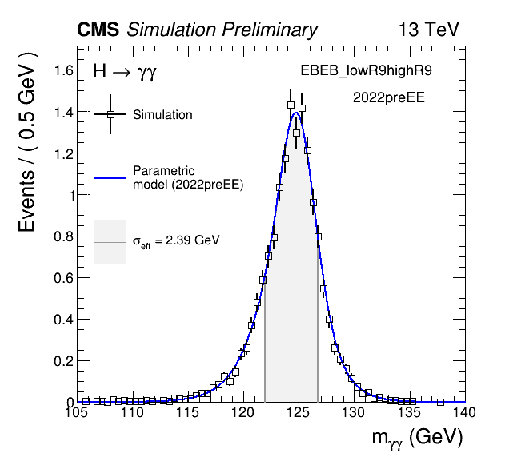

# Signal modeling
Let's move to the signal directory:
```
cd $CMSSW_BASE/src/flashggFinalFit/Signal
```

In this section we will learn how to build signal models from $H \rightarrow \gamma\gamma$ Monte-Carlo simulation. We will use the workspaces built in the previous section (Trees2WS) as input. If you ran into problems with the previous section/arrived late then do not worry, you can copy the workspaces from the `cmshgg` area:
```
PATH_TO_INPUTS="Add path to eos user area"

cp -rp /eos/cms/store/group/phys_higgs/cmshgg/tutorials/HiggsDNA_FinalFits_2024/FinalFits_tutorial/workspaces ${PATH_TO_INPUTS}
```

In the signal modeling we construct a parametric signal pdf to fit a mass peak in MC events. We perform a simultaneous fit to multiple $m_H$ points (i.e. MC generated at different values of the Higgs boson mass, $m_H$). The parameters of the models are described as functions of $m_H$. Note this final fits code can run on a single mass point where the model parameters are defined as constants, but in this example we will fit the model to MC at $m_H$~=~120, 125 and 130 GeV. 

The code constructs a separate model per process x category x vertex scenario combination. The vertex scenario is split into right-vertex and wrong-vertex depending on dZ, which is the distance between the reconstructed primary vertex and the true diphoton vertex. If this is greater than 0.1 cm, then the events are labelled as wrong-vertex. The energy resolution for right-vertex events is dominated by the ECAL performance (narrower), whereas for wrong-vertex events it is dominated by the vertex location (wider).

We recommend to process each era of data-taking separately e.g. 2022preEE and 2022postEE to correctly model the resolution-vs-time depedence, and keep track of year-dependent systematic uncertainties. You should repeat the steps below (with a separate config file) for each data-taking era. In this tutorial we only consider a single era: 2022preEE.

There are two options for which PDF to fit:
* Sum of up to N Gaussians, where N by default is set to five.
* Double Crystal Ball functions with an additional Gaussian

In this tutorial we will follow the steps to fit the sum of Gaussians. If in your analysis you choose to fit the DCB+Gaussian then you can skip the F-test and add the option `--useDCB` to the `--modeOpts` string when performing the Signal fit. 

In the signal modeling we steer everything with a `config.py` file, e.g. for this tutorial we have `config_tutorial_2022preEE.py`:
```
# Config file: options for signal fitting

_year = '2022preEE'

signalScriptCfg = {

  # Setup
  'inputWSDir':'PATH_TO_INPUTS/workspaces/signal_%s'%_year,
  'procs':'auto', # if auto: inferred automatically from filenames
  'cats':'auto', # if auto: inferred automatically from (0) workspace
  'ext':'tutorial_%s'%_year, # name of directory to store jobs scripts and outputs
  'analysis':'tutorial', # To specify which replacement dataset mapping (defined in ./python/replacementMap.py)
  'year':'%s'%_year, # Use 'combined' if merging all years: not recommended
  'massPoints':'120,125,130',

  #Photon shape systematics  
  'scales':'Scale', # separate nuisance per year
  'scalesCorr':'', # correlated across years
  'scalesGlobal':'', # affect all processes equally, correlated across years
  'smears':'Smearing', # separate nuisance per year

  # Job submission options
  'batch':'condor', # ['condor','SGE','IC','local']
  'queue':'espresso',

}
```
Please change the `inputWSDir` value to match the full path to your workspaces. 

The scripts are ran using:
```
python3 RunSignalScripts.py --inputConfig config_tutorial_2022preEE.py --mode {MODE} (--modeOpts "{MODEOPTS}") (--printOnly)
```
* `--printOnly`: writes jobs without submitting which is useful for testing/debugging. You can go and run the job scripts locally. I find it helps to run these in the python interpreter for debugging with `python3 -i`.
* The job scripts and job output will be stored in the directory `outdir_{ext}/{MODE}`.

## F-test
The signal modeling F-test is used to determine the optimum number of Gaussians to use in the final signal model for a given process x category x vertex scenario combination. We choose the number which minimizes the reduced $\chi^2$ = $\chi^2/n_{dof}$.

The `fTest` mode creates one job per analysis category (10), and the output is a json file in `outdir_{ext}/fTest/json` which specifies the optimum number of Gaussians for each signal process, split into the right-vertex and wrong-vertex scenarios.

We will add the option to produce the plots from the F-test. Run the following command:
```
python3 RunSignalScripts.py --inputConfig config_tutorial_2022preEE.py --mode fTest --modeOpts "--doPlots"
```
This will submit the jobs to condor on the espresso queue as specified in the config file. You can also run the jobs locally, but this might take some time. 

When completed check the output json files to make sure they look sensible. Let's also take a look at the plots. They are stored in `outdir_{ext}/fTest/Plots`. Below you can see the examples for fitting ggH (GG2H) in the `EBEB_lowR9highR9` analysis category:

<details>
<summary>F-test for (GG2H,EBEB_lowR9highR9,RV)</summary>


</details>

<details>
<summary>F-test for (GG2H,EBEB_lowR9highR9,WV)</summary>


</details>

Here we find the optimum number of Gaussians is 4 (2) for the RV (WV) scenario. This information should be reflected in `outdir_tutorial_2022preEE/fTest/json/nGauss_EBEB_lowR9highR9.json`. These json files are used as input when constructing the final signal model. If necessary these json files can be edited by hand to reduce the number of Gaussians e.g. if low MC stats lead to multiple peaked structure. This is why you should always check the plots.

## Calculating the photon shape systematics
In this section we calculate the effect of the photon scale and smearing uncertainties. The shift in the **mean**, **sigma** and **rate** are calculated for the systematic-shifted `RooDataHists` and compared to the corresponding peak in the nominal `RooDataSet`. The systematic uncertainty names are taken from the `scales,scalesCorr,scalesGlobal,smears` containers in the config file. In this tutorial we only consider a single `Scale` and a single `Smearing` nuisance parameters. 

You can run the following command:
```
python3 RunSignalScripts.py --inputConfig config_tutorial_2022preEE.py --mode calcPhotonSyst
```
Again this will submit a job per analysis category. The output is a pandas DataFrame which stores the effects of the different systematics.
```
$ python3
>>> import pandas as pd
>>> import pickle as pkl
>>> with open("outdir_tutorial_2022preEE/calcPhotonSyst/pkl/EBEB_lowR9highR9.pkl", "rb") as fpkl:
...     data = pkl.load(fpkl)
>>> data.iloc[0]
```
<details>
<summary>Output</summary>

```
proc                                                            GG2H
cat                                                 EBEB_lowR9highR9
inputWSFile        /eos/user/j/jlangfor/icrf/hgg/FinalFitsTutoria...
nominalDataName                       ggh_125_13TeV_EBEB_lowR9highR9
Scale_mean                                                   0.00074
Scale_sigma                                                 0.000904
Scale_rate                                                  0.000025
Smearing_mean                                               0.000109
Smearing_sigma                                              0.013709
Smearing_rate                                               0.002973
Name: 0, dtype: object
```
</details>

These values will read in and baked into the signal model as variations in the mean, width and normalisation. For example the mean of the signal models is defined as:

```math
\rho = (m_H-\Delta m_H)*(1 + \alpha^{\rm{mean}}_{\rm{Scale}}*\theta_{\rm{Scale}} + \alpha^{\rm{mean}}_{\rm{Smearing}}*\theta_{\rm{Smearing}})
```

Where $\alpha$ are the terms in the DataFrame, and $\theta$ represent the nuisance parameters which are defined in the final model. Say if $\theta_{\rm{Scale}}$ is pulled to a value of +1, then the peak mean will be shifted by $\alpha_{\rm{Scale}}$. The effects on the mean, sigma and rate are correlated for a given systematic uncertainty choice. 

If you skip this step, then you must run the signal fit with the `--skipSystematics` option.

## Replacement and XSBR map
In `Signal/tools` you will find two python files which define the configuration for the shape replacement mapping (`replacementMap.py`) and the cross-section/branching fraction mapping (`XSBRMap.py`). Both of these must be updated to reflect the analysis you are running. We have already provided the maps for this analysis: `tutorial`. 

The `replacementMap.py` is used to specifiy the replacement (proc, cat) to use for the signal shape if there are too few entries in the MC sample. The default threshold for this is set at 100, but can be toggled in the signal fitting script with the option `--replacementThreshold N`. For RV events, the configuration file defines a separate replacement (proc,cat) for each analysis category. For the WV events, given that the shape is effectively independent of the selection then we define a single replacement (proc,cat), independent of the analysis category. The mapping for the `tutorial` analysis is shown below. 

<details>
<summary>Replacement map</summary>

```
# Tutorial analysis
globalReplacementMap['tutorial'] = od()
# For WRONG VERTEX SCENARIO:
#  * single proc x cat for wrong vertex since for dZ > 1cm shape independent of proc x cat
#  * use proc x cat with highest number of WV events
globalReplacementMap['tutorial']['procWV'] = "GG2H"
globalReplacementMap['tutorial']['catWV'] = "EBEB_highR9highR9"
# For RIGHT VERTEX SCENARIO
#  * default mapping is to use diagonal process from given category 
#  * if few events in diagonal process then may need to change the category aswell (see catRVMap)
#  * map must contain entry for all cats being processed (for replacement proc and cat)
globalReplacementMap['tutorial']['procRVMap'] = od()
globalReplacementMap["tutorial"]["procRVMap"]["EBEB_highR9highR9"] = "GG2H"
globalReplacementMap["tutorial"]["procRVMap"]["EBEB_highR9lowR9"] = "GG2H"
globalReplacementMap["tutorial"]["procRVMap"]["EBEB_lowR9highR9"] = "GG2H"
globalReplacementMap["tutorial"]["procRVMap"]["EBEE_highR9highR9"] = "GG2H"
globalReplacementMap["tutorial"]["procRVMap"]["EBEE_highR9lowR9"] = "GG2H"
globalReplacementMap["tutorial"]["procRVMap"]["EBEE_lowR9highR9"] = "GG2H"
globalReplacementMap["tutorial"]["procRVMap"]["EEEB_highR9highR9"] = "GG2H"
globalReplacementMap["tutorial"]["procRVMap"]["EEEB_highR9lowR9"] = "GG2H"
globalReplacementMap["tutorial"]["procRVMap"]["EEEB_lowR9highR9"] = "GG2H"
globalReplacementMap["tutorial"]["procRVMap"]["EEEE_incl"] = "GG2H"
globalReplacementMap['tutorial']['catRVMap'] = od()
globalReplacementMap["tutorial"]["catRVMap"]["EBEB_highR9highR9"] = "EBEB_highR9highR9"
globalReplacementMap["tutorial"]["catRVMap"]["EBEB_highR9lowR9"] = "EBEB_highR9lowR9"
globalReplacementMap["tutorial"]["catRVMap"]["EBEB_lowR9highR9"] = "EBEB_lowR9highR9"
globalReplacementMap["tutorial"]["catRVMap"]["EBEE_highR9highR9"] = "EBEE_highR9highR9"
globalReplacementMap["tutorial"]["catRVMap"]["EBEE_highR9lowR9"] = "EBEE_highR9lowR9"
globalReplacementMap["tutorial"]["catRVMap"]["EBEE_lowR9highR9"] = "EBEE_lowR9highR9"
globalReplacementMap["tutorial"]["catRVMap"]["EEEB_highR9highR9"] = "EEEB_highR9highR9"
globalReplacementMap["tutorial"]["catRVMap"]["EEEB_highR9lowR9"] = "EEEB_highR9lowR9"
globalReplacementMap["tutorial"]["catRVMap"]["EEEB_lowR9highR9"] = "EEEB_lowR9highR9"
globalReplacementMap["tutorial"]["catRVMap"]["EEEE_incl"] = "EEEE_incl"
```
</details>
<br>

The normalisation of the signal model is configured with `XSBRMap.py`. The normalisation for process, i, landing in analysis category, j, is:

```math
N_{ij} = [\sigma \cdot \mathcal{B}]_i \, \cdot \, \epsilon_{ij} \, \cdot \, \mathcal{L}
```

where $[\sigma \cdot \mathcal{B}]_i$ is the cross-section-times-branching-fraction for process, $i$. This is what must be configured in `XSBRMap.py`. For Run 2 we used the LHCHWG YR4 cross sections splines provided in Combine, however these are not yet updated for Run 3, so for this tutorial we will use the `constant` mode with a factor to provide the 13.6 TeV cross sections. The $H\rightarrow\gamma\gamma$ branching fraction is modeled with the spline.

<details>
<summary>XSBR map</summary>

```
globalXSBRMap['tutorial'] = od()
globalXSBRMap['tutorial']['decay'] = {'mode':'hgg'}
globalXSBRMap['tutorial']['GG2H'] = {'mode':'constant', 'factor':51.96}
globalXSBRMap['tutorial']['VBF'] = {'mode':'constant', 'factor':4.067}
```
</details>
<br>

The term $\epsilon_{ij}$ in the normalisation equation represents the efficiency-times-acceptance, or in other words the fraction of the total process $i$ events which land in analysis category $j$. We have configured HiggsDNA such that the sum of weights for process $i$ in category $j$ is directly equal to $\epsilon_{ij}$. The final term, $\mathcal{L}$, is the integrated luminosity.

## Signal fit
To construct the final signal model for each (proc, cat, vertex-scenario) combination, we will run:
```
python3 RunSignalScripts.py --inputConfig config_tutorial_2022preEE.py --mode signalFit --modeOpts "--doPlots" --groupSignalFitJobsByCat
```
The `--groupSignalFitJobsByCat` option concatenates the jobs to again run a single job per analysis category i.e. it runs over the processes (GG2H,VBF) in sequence. The output of this step is a separate ROOT file containing the signal model workspace `wsig_13TeV` for each (proc, cat) combination. These will be stored in `outdir_tutorial_2022preEE/signalFit/output`. 

Let's look at some of the output plots that are produced by adding the `--doPlots` option to the `--modeOpts` string.

<details>
<summary>(GG2H, EBEB_lowR9highR9, RV) model split into Gaussian components</summary>


</details>

<details>
<summary>(GG2H, EBEB_lowR9highR9, WV) model split into Gaussian components</summary>


</details>

<details>
<summary>Interpolated total model as a function of $m_H$ for (GG2H, EBEB_lowR9highR9)</summary>


</details>

<details>
<summary>Normalisation components as a function of $m_H$ for (GG2H, EBEB_lowR9highR9)</summary>


</details>

<br>

There are many additional options which can be triggered for the signal fitting step, including switching to the DCB+Gaussian, skipping the vertex scenario splitting, skipping the systematics, and changing the minimizer options. These are all described in more detail in the Final Fits Signal [ReadME](https://github.com/cms-analysis/flashggFinalFit/tree/higgsdnafinalfit/Signal#final-model-construction ) .

Let's open a signal model file and inspect the contents. Do you understand what all the components are?
```
$ python3
>>> import ROOT
>>> f = ROOT.TFile("outdir_tutorial_2022preEE/signalFit/output/CMS-HGG_sigfit_tutorial_2022preEE_GG2H_2022preEE_EBEB_lowR9highR9.root")
>>> w = f.Get("wsig_13TeV")
>>> w.Print()
```

<details>
<summary>Or in the ROOT interpreter</summary>

```
$ root -b outdir_tutorial_2022preEE/signalFit/output/
root [1] wsig_13TeV->Print()
```
</details>


## Running the packager
For the results extraction with Combine, we package the individual ROOT files from the `signalFit` step into a single file per category. 

Run the following command:
```
python3 RunPackager.py --cats EBEB_highR9highR9,EBEB_highR9lowR9,EBEB_lowR9highR9,EBEE_highR9highR9,EBEE_highR9lowR9,EBEE_lowR9highR9,EEEB_highR9highR9,EEEB_highR9lowR9,EEEB_lowR9highR9,EEEE_incl --exts tutorial_2022preEE --mergeYears
```
This can be used to merge across years/data-taking eras by specifying multiple extensions in the `--exts` option. The output of this step are the packaged signal models in `outdir_packaged` which are ready for the Combine fits.

## Signal model plots
Before moving on, let's make some pretty plots of the final signal models. You can run the following command:
```
for cat in {EBEB_highR9highR9,EBEB_highR9lowR9,EBEB_lowR9highR9,EBEE_highR9highR9,EBEE_highR9lowR9,EBEE_lowR9highR9,EEEB_highR9highR9,EEEB_highR9lowR9,EEEB_lowR9highR9,EEEE_incl}; do python3 RunPlotter.py --procs all --years 2022preEE --cats $cat --ext packaged; done
```
This will sum over all processes (GG2H and VBF) in the analysis category.

<details>
<summary>Example signal model plots for the EBEB_lowR9highR9 category</summary>


</details>

<br>